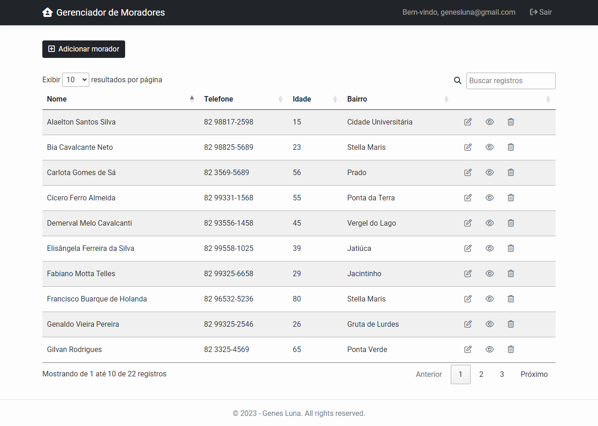

   
# Home Owners App

## Project related to the discipline of Web Development at CESMAC college

### Project requirements:
Create a homeowners registration application where you can authenticate users to and save their data in a browser session. Once logged in, the user should be able to create, edit, view and delete home owners.

### Project result:

